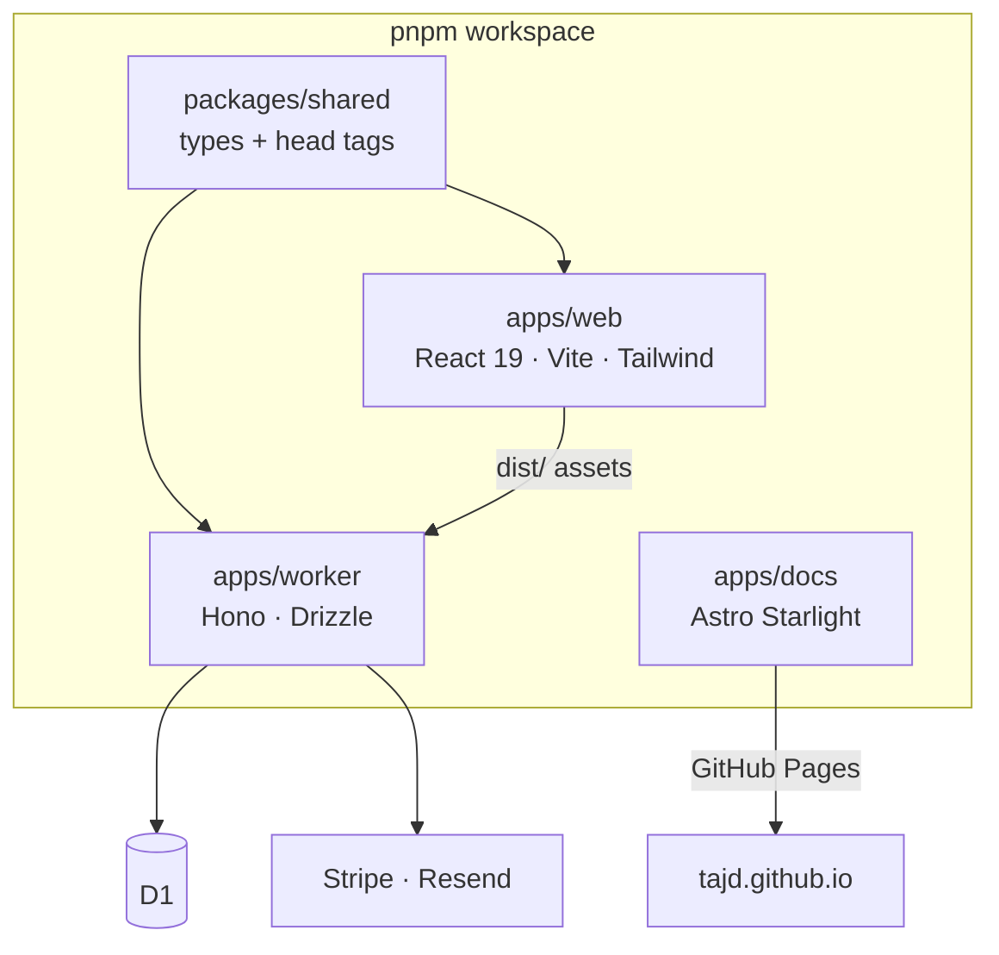

One pnpm workspace, four packages, one deploy. `apps/web` builds to static assets;
`apps/worker` serves the API and those assets from a Cloudflare Worker; `packages/shared`
holds the types both use; `apps/docs` builds this site.

`apps/web` and `apps/worker` never import each other. The arrow between them is build
output, not code: the worker serves `apps/web/dist`. The only cross-references in
source are comments pointing one way or the other.

## The rules that hold it together

Five invariants are enforced by the code, not by convention:

- **No runtime imports across `apps/web` and `apps/worker`.** The boundary is HTTP.
- **`packages/shared` never imports from `apps/web`.** It is the leaf, not the hub.
- **Semantic design tokens only.** `apps/web/tailwind.config.ts` replaces Tailwind's
  colour palette outright with `paper`, `ink`, `accent`, `muted`, `rule`, `elev`, `win`
  and `error`. `bg-red-500` does not resolve — the palette makes raw colours
  unavailable rather than a lint rule warning about them.
- **One error contract.** Route handlers and their helpers return `{ error: Response }`;
  pure logic throws. Callers narrow on `'error' in result` and hand the response
  straight back to Hono.
- **One route registry.** `apps/web/src/seo.config.ts` exports a `routes` array that
  modules push into at load time, and prerendering, the sitemap and the feeds all read
  from that one list.

Each of those was checked against source before being written down, and each is stated
in full — with the file and line evidence — in
[`AGENTS.md`](https://github.com/TAJD/project-template/blob/main/AGENTS.md).

## Where the detail lives

`AGENTS.md` is the canonical instruction set for anyone, human or agent, working in the
repo: the invariants above, the dev commands, the gotchas that cost real debugging time,
and the rules for autonomous work. This page summarises it and links to it. It does not
copy it, because an invariant that exists in two places is an invariant that will
disagree with itself.

The per-module architecture — touch-points, data model, threat models, deliberate
deviations — is on each [module page](../../modules/).
