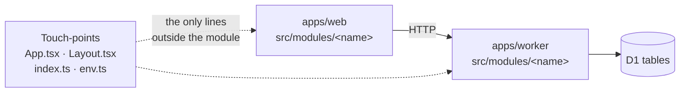

A module here is a feature that can be removed. That is the whole definition, and it
carries three obligations.

**It is self-contained.** Module code lives under `apps/web/src/modules/<name>/` and
`apps/worker/src/modules/<name>/`. Nothing outside those directories holds logic that
only that module needs.

**It documents its touch-points.** A module still has to attach to the app somewhere:
a route in `App.tsx`, a nav link in `Layout.tsx`, a route mount in the worker's
`index.ts`, an env var, a D1 table. Every one of those is listed on the module's page,
by file, so nobody has to grep for them.

**It documents its removal.** Each page ends with numbered removal steps, ending in
`pnpm check`. Follow them and the gate stays green with the module gone.

The dotted edges are what removal is about. Deleting a module directory is easy;
finding the handful of lines elsewhere that reference it is the part that goes wrong,
so the pages name them.

## The modules

- [Account](./account/) — users, sessions, password hashing, email verification, reset,
  account settings, test auth.
- [Billing](./billing/) — Stripe Checkout, portal, webhooks, subscription state in D1,
  a gated sample page.
- [Blog](./blog/) — MDX posts, drafts, tags, feeds, SEO registration. Search is built
  alongside it but is not blog-specific.
- [Feedback](./feedback/) — a thumbs-up/down widget posting to any endpoint. The
  smallest one, and the clearest example of the pattern.
- [R2 proxy](./r2-proxy/) — a `/data/*` route serving R2 objects with real HTTP
  range support. Opt-in: it 404s until a bucket is bound.

Adding a module? Follow the same three obligations, and give it a page here that ends
in removal steps. A module nobody can delete is a framework.
